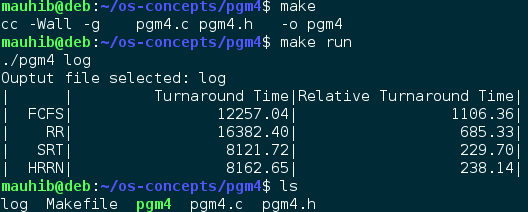

#Program 4 – Simulation of Uniprocessor Scheduling Algorithms

##Problem Statement
 The assignment was to perform Monte Carlo simulations of different uniprocessor scheduling algorithms and measuring the average turnaround time and the average relative turnaround time for each. The scheduling algorithms that were used in the simulation were FCFS (First Come First Serve), RR (Round Robin with q=1), SRT(Shortest Remaining Time), and HRRN (Highest Response Ratio Next). Each job was supposed to arrive at its index number. The service time required for each job was supposed to be randomly generated between 1 and 50. The simulation data was then supposed to be used to report the average turnaround time and the average relative turnaround time for each algorithm in a tabular format.

##Approach

 For this experiment I am using Debian Linux running on a dual-core system. I used the ANSI C programming language for my design. My design consists of using a job struct called _jobs\_t_ to simulate processes/jobs in memory. It has variables inside it to keep track of the different times (arrival, service, turnaround, remaining). I also used a time array, which is the output of each of the algorithms. Every algorithm takes jobs, schedules them in the time array, and reports it back. Each of the algorithms to be simulated were implemented as its own subroutine. This makes it easy to add more algorithms to the simulation. To do that, one needs to add a subroutine to the program, change a few constants like NUM\_ALGORITHMS, and add a case to three different case statements. The _main()_ subroutine in my program calls each of the algorithms defined multiple times (NUM\_SIMULATIONS sets how many simulations are performed), and averages up the results. Each individual simulation is output to the file specified in the program argument, while the average results are output directly to _stdout_. The _DEBUG_ constant can be set to 1 to see the time array after each scheduling. For debugging purposes, it is also suggested to the decrease the number of simulation and the number of jobs per simulation (NUMBER\_JOBS\_PER\_SIMULATION). The TEST constant can be set to 1, to use a predefined jobs array, instead of a randomly generated one. This is predefined array is defined in _generateJobArrayTest()_.

##Solution

 The build environment just consists of a Makefile. To compile from source, _make_ and _gcc_ are required. Building is simple: change into the directory and run the command &quot;_make_&quot;. Once the program compiles. It can either be run using the pgm4 file that was compiled or for simplicity, just &quot;_make run_&quot; to run the program with default command line arguments. This stores the output data in the file called _log_. The following picture shows an example build and execution of the program.
 
 
 
 The table provided below was generated using the default configuration of the program: service time between 1 and 50, 1000 jobs per simulation, and 1000 simulations. These parameters can easily be changed by changing the constants defined on top of the pgm4.c file.

**Table 1 – Performance of Uniprocessor Scheduling Algorithms**

| Algorithm Name | Average Turnaround Time (TR) | Average Relative Turnaround Time (TRTS) |
| --- | --- | --- |
| First Come First Serve | 12,257.04 | 1,106.36 |
| Round Robin (q=1) | 16,382.40 | 685.33 |
| Shortest Remaining Time | 8,121.72 | 229.70 |
| Highest Response Ratio Next | 8,162.65 | 238.14 |

##Analysis of Output

 The turnaround time is defined as the time a job spends in execution and waiting combined, which might be biased depending on how long a job runs. Therefore, we normalize this result by dividing it by the service time. This value, called relative turnaround time yields a more objective estimate of the performance. This number represents how much time a job spent waiting relative to its lifecycle.
 I shall talk about FCFS and RR first. The data shows that FCFS and RR cause an average turnaround time and a relative turnaround time that is higher than the others, meaning they are less efficient than the others. Out of the two, even though RR has a higher turnaround time, it seems more &quot;fair&quot; than FCFS because of the low relative turnaround time.
 SRT and HRRN have very similar turnaround time and relative turnaround time, so I would say that they are almost as fair as each other and can be used as alternatives for each other. It is also clear that SRT and HRRN are much more efficient and fair than FCFS and RR.
 It is important to note that my solution depended on C's rand() function for generating random numbers of a uniform distribution. It would be interesting to note how the output varies if random numbers were generated from a different probability distribution. That would show how these algorithms work for different applications.
